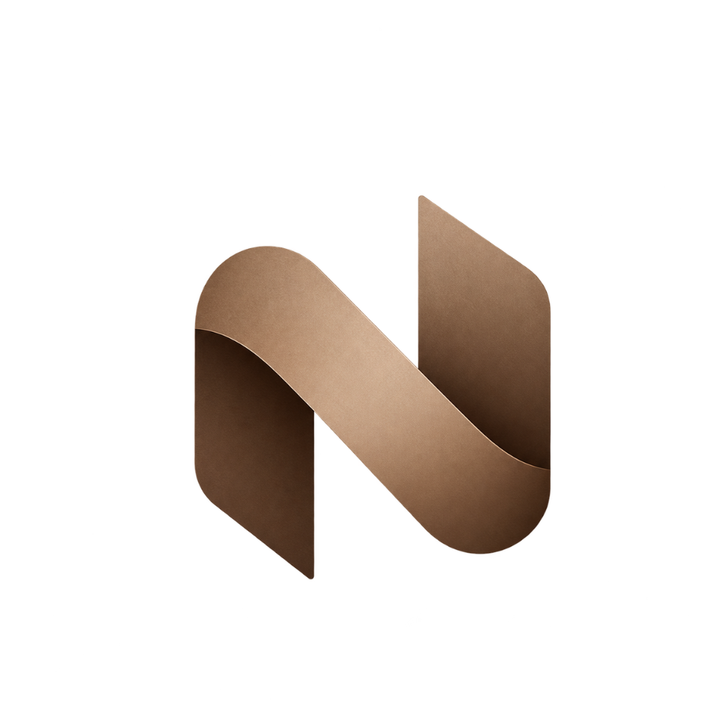

# Nexlink Solutions

<div align="center">
  

  <h3>Turning Ideas Into Meaningful Digital Experiences & Functional Software Products</h3>

  <p>
    <strong>Bedworth Park, Gauteng, South Africa • Founded July 2025</strong><br />
    <a href="mailto:nexlinksolutionsza@gmail.com">nexlinksolutionsza@gmail.com</a>
  </p>

  <p>
    
    
    
    
    
  </p>
</div>

---

## 📖 About Nexlink Solutions

**Nexlink Solutions** is a technology and digital solutions company dedicated to helping businesses, entrepreneurs, and organizations turn ideas into meaningful digital experiences and functional software products. 

We believe technology should do more than simply exist. It should:
- **Solve problems** that hinder business growth
- **Simplify complex processes** through intuitive engineering
- **Connect people** with seamless digital touchpoints
- **Create real opportunities** for measurable, sustainable growth

From helping small businesses establish a standout, professional digital presence to architecting specialized platforms and enterprise systems that support mission-critical operations, our goal is to build technology that is practical, intuitive, and designed with the future in mind.

### Our Core Philosophy
> **"Technology should be purposeful, accessible, and designed to move businesses forward."**

Through thoughtful design, practical engineering, and deep collaboration, we partner with our clients to build stronger digital foundations and turn high-impact ideas into products that matter.

---

## 🚀 Core Capabilities & Services

Nexlink Solutions specializes in five key service pillars:

| Service Pillar | Description | Key Deliverables |
|---|---|---|
| **Website Design & Development** | Modern, high-performance websites engineered to establish authority and convert visitors into long-term clients. | Custom UI/UX, responsive layouts, SEO-optimized architecture, headless CMS. |
| **Web Application Development** | Scalable, full-stack web applications and client dashboards that automate processes and power daily operations. | React / Next.js applications, admin portals, REST & GraphQL APIs, secure database modeling. |
| **Mobile App Development** | Native and cross-platform mobile apps for iOS and Android built to solve user problems on the go. | Cross-platform React Native / Flutter, offline sync, push notifications, App Store optimization. |
| **Custom Software Development** | Specialized platforms and custom systems designed precisely around your organization's unique workflows. | Business process automation, custom CRM/ERP integrations, proprietary tools, third-party API engines. |
| **AI-Powered Digital Solutions** | Intelligent integrations leveraging AI and ML to automate workflows, derive insights, and enrich customer interactions. | AI chatbots, predictive analytics, intelligent process automation, natural language workflows. |

---

## ✨ Key Platform Features

### 1. Split-Panel Bento Grid FAQ & Terms Pages
- **Interactive Bento Card Layout**: Categories are anchored on the left sidebar, while clickable bento cards on the right expand to show rich, in-depth documentation without leaving the view.
- **GDPR Law Compliance**: Comprehensive articles covering data subject rights (Articles 15–22), lawful basis of processing, standard contractual clauses (SCCs) for international transfers, and 72-hour breach notification procedures.
- **POPIA Law Compliance (South Africa)**: Fully honors the Protection of Personal Information Act (POPIA Chapter 3), designating Nexlink Solutions as a Responsible Party, detailing the 8 lawful processing conditions, Section 23 access/correction rights, and Section 72 cross-border safeguards.

### 2. Intelligent Global Locale & Currency Engine
- Built-in `useLocaleCurrency` utility detects the visitor's geographic locale automatically via browser headers (`navigator.language`).
- Formats project budget tiers in local currencies (ZAR `R`, EUR `€`, GBP `£`, USD `$`, JPY `¥`, and 50+ world currencies) using real-time dynamic conversions with `Intl.NumberFormat`.

### 3. Direct 15-Minute Strategy Call Integration
- Prominent call-to-action button: **"Get in Touch for a Free 15-Minute Call"** with hover animation.
- Pre-formats an email template directly addressed to `nexlinksolutionsza@gmail.com` with meeting agenda fields.

### 4. Animated Service Specialization Cycle
- The *Deliver* section features a centered, auto-cycling animation using Framer Motion's `AnimatePresence`.
- Cycles seamlessly through the 5 core specializations with fluid blur/scale/fade transitions, specialization index counters, and interactive navigation pills.

### 5. Rank #1 Google SEO Architecture
- Complete **Schema.org JSON-LD** structured data for `Organization`, `ProfessionalService`, and `WebSite`.
- South African local SEO geo-tags (`geo.region: ZA-GT`, `geo.placename: Bedworth Park`).
- Open Graph and Twitter Card tags configured with the official Nexlink Solutions logo and preview descriptions.
- Fast, accessible layout compliant with Core Web Vitals best practices.

---

## 🛠️ Tech Stack & Dependencies

- **Frontend Core**: [React 18.2](https://reactjs.org/)
- **Build Tool**: [Vite 3.2](https://vitejs.dev/)
- **Styling**: [Tailwind CSS 3.1](https://tailwindcss.com/) & [PostCSS](https://postcss.org/)
- **Animations**: [Framer Motion 7.5](https://www.framer.com/motion/)
- **Smooth Scrolling**: [Locomotive Scroll 4.1](https://locomotivemtl.github.io/locomotive-scroll/) & `react-locomotive-scroll`
- **Routing**: [React Router DOM v6](https://reactrouter.com/)
- **Icons**: [React Icons (Feather & Brand Icons)](https://react-icons.github.io/react-icons/)

---

## 📂 Project Architecture

```
Digitaly-master/
├── public/
│   ├── assets/              # Static media assets & snapshots
│   ├── favicon.png          # Nexlink Solutions browser icon
│   └── logo.png             # Official Nexlink Solutions brand logo
├── src/
│   ├── assets/              # Component illustrations, crowns, badges & cards
│   ├── components/          # Reusable UI components
│   │   ├── Button/          # Primary CTA & interactive button components
│   │   ├── FooterLink/      # Animated footer link items
│   │   ├── Label/           # Service & tag badges
│   │   ├── Layout/          # PageLayout shell with navigation & transition wrappers
│   │   ├── Navbar/          # Responsive navigation header
│   │   ├── PageTransition/  # Waterfall screen transition loader
│   │   ├── SectionHeader/   # Reusable section title & badge headers
│   │   └── Work/            # Selected & awarded work display cards
│   ├── constants/           # Global animation variants & motion presets
│   ├── context/             # TransitionContext for seamless route changes
│   ├── pages/               # Top-level page routes
│   │   ├── AboutPage.jsx    # Company story, values, Bedworth Park roots & milestones
│   │   ├── ContactPage.jsx  # Inquiry form, free call button, localized currency selector
│   │   ├── FAQPage.jsx      # Bento card knowledge base with GDPR & POPIA compliance
│   │   ├── HomePage.jsx     # Master landing page assemble
│   │   ├── ProjectsPage.jsx # Software, app, and web development case studies
│   │   ├── ServicesPage.jsx # In-depth breakdown of 5 core services & deliverables
│   │   └── TermsPage.jsx    # Legal terms, IP ownership, GDPR & POPIA agreements
│   ├── sections/            # Home page sectional components
│   │   ├── AwardedWorks/    # Featured project highlights
│   │   ├── Clients/         # Client partner showcase
│   │   ├── CTA/             # Pre-footer conversion section
│   │   ├── Deliver/         # Animated specialization cycle & metrics
│   │   ├── Footer/          # Global footer with contact info & social handles
│   │   ├── Home/            # Hero section with brand showcase
│   │   ├── SelectedWorks/   # Curated product spotlights
│   │   └── Team/            # Leadership and engineering team
│   ├── utils/               # Helpers
│   │   ├── sanitize.js      # Defensive input sanitization & XSS prevention
│   │   └── useLocaleCurrency.js # Browser locale detection & currency formatting
│   ├── App.jsx              # Main routing hub
│   └── main.jsx             # React DOM root entry
├── index.html               # Head tags, Google SEO meta, JSON-LD Schema & favicon
├── package.json             # Scripts & dependencies
└── tailwind.config.cjs      # Custom colors, fonts, and responsive breakpoints
```

---

## 💻 Local Development Setup

### Prerequisites
- [Node.js](https://nodejs.org/) (version 16.x or newer recommended)
- [npm](https://www.npmjs.com/) or [yarn](https://yarnpkg.com/)

### 1. Clone the repository
```bash
git clone https://github.com/NexLink-Hub/Nexlink-Site-Test-One.git
cd Nexlink-Site-Test-One
```

### 2. Install dependencies
```bash
npm install
```

### 3. Start local development server
```bash
npm run dev
```
Open your browser and navigate to `http://localhost:5173` (or the port specified in terminal output).

### 4. Build for production
```bash
npm run build
```
Creates an optimized production bundle in the `dist/` directory.

### 5. Preview production build locally
```bash
npm run preview
```

---

## 🔒 Privacy & Compliance

Nexlink Solutions operates with privacy and security by design:
- **GDPR (General Data Protection Regulation)**: Full adherence to data subject access, rectification, portability, and erasure rights. Inquiries handled via `nexlinksolutionsza@gmail.com`.
- **POPIA (Protection of Personal Information Act, South Africa)**: Nexlink Solutions acts as a designated Responsible Party under Chapter 3 of POPIA, upholding the 8 lawful processing principles.

---

## 📬 Contact & Location

- **Company**: Nexlink Solutions
- **Headquarters**: Bedworth Park, Germiston, Gauteng, South Africa
- **Timezone**: GMT+2 (South Africa Standard Time - SAST)
- **General & Partnership Inquiries**: [nexlinksolutionsza@gmail.com](mailto:nexlinksolutionsza@gmail.com)
- **Official Repository**: [https://github.com/NexLink-Hub/Nexlink-Site-Test-One](https://github.com/NexLink-Hub/Nexlink-Site-Test-One)

---

<div align="center">
  <p>© 2025–2026 Nexlink Solutions. All rights reserved.</p>
</div>
